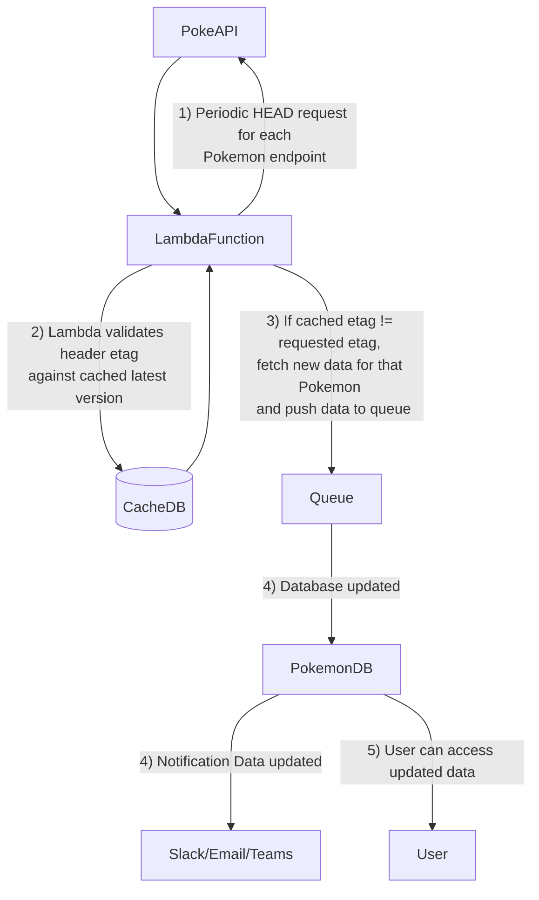

## Imagine you had to build a system in the cloud that would continiously deliver updates to the investor with updates about Pokémon. Draw an architecture for exposing new changes to the existing Pokémon to the investor

### Notes:
* Architecture depends on a serverless (e.g. Lambda) function that periodically checks for updates. 
* As no date modified is included API (appears to be infrequently updated), etags contained in the API response headers are exploited
* If PokeAPI was internal resource, possible it could push an update to message queue and avoid periodic "HEAD" on requests and reduce update latency.
* SQL DB chosen to store data, but csv/parquet file on S3 could be used. Updated data could also be pushed via Slack/Email but likely stakeholder would want whole dataset.
